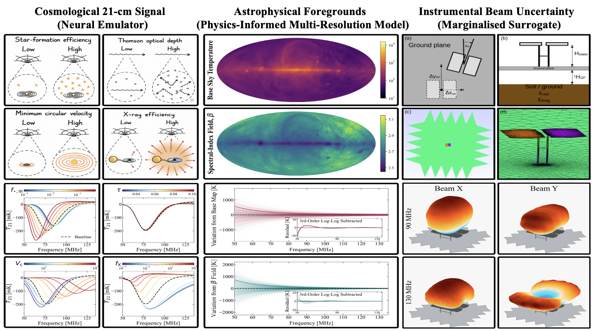
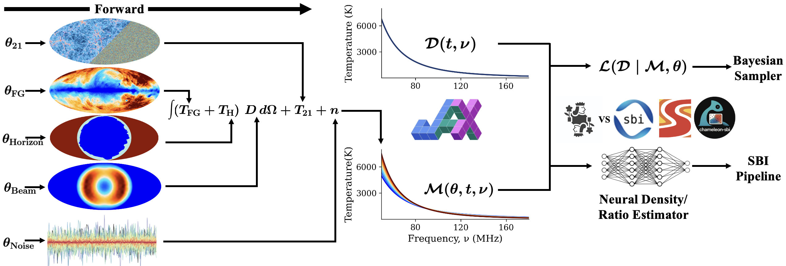
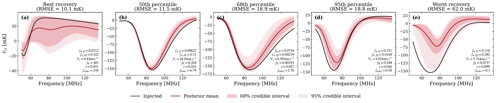

# Global 21-cm Inference Benchmark

`global21cm-benchmark` is a fixed, end-to-end Bayesian inference benchmark for
global 21-cm cosmology. It packages 100 simulated observations, an accelerated
hybrid forward model, explicit and analytically collapsed likelihoods, and a
reference Nested Slice Sampling (NSS) configuration. The expensive simulation
products are supplied as immutable tensors, so reproducing the benchmark does
not require the pipelines that generated them.

## Installation

Python 3.11--3.13 is supported.

```bash
git clone https://github.com/JacobTutt/global-21cm-inference-benchmark.git
cd global-21cm-inference-benchmark
pip install .
```

For NVIDIA GPUs, install the CUDA-enabled JAX extra:

```bash
pip install ".[gpu]"
```

## 1. Forward model

The forward model combines three representations selected for the physical
and computational structure of each uncertainty source:

- **Cosmological signal:** a JAX neural emulator maps six continuous
  astrophysical parameters to an 86-channel global 21-cm spectrum.
- **Astrophysical foregrounds:** 30 regional spectral indices preserve the
  measured spatial structure of the low-frequency radio sky without sampling
  an independent spectrum in every pixel.
- **Instrumental beam:** a 100-mode linear surrogate captures chromatic beam
  uncertainty through a precomputed frequency-time response operator.

The likelihood adds one parameter for the amplitude of independent Gaussian
noise. Each packaged observation contains 86 frequencies and 37 observing
times.



*Figure 1. Hybrid forward model combining neural emulation, a physics-informed
foreground representation, and a linear surrogate of beam uncertainty.*

The package exposes one explicit forward model:

```python
import jax

from global21cm_benchmark import Dataset, Prior, forward_model

dataset = Dataset(0)
parameters = Prior().sample_full(jax.random.key(0))[0]
prediction = forward_model(
    parameters[:30],       # foreground spectral indices
    parameters[30:130],    # beam coefficients
    parameters[130:136],   # signal parameters
)
```

The injected profile and parameters are available as
`dataset.injected_signal` and `dataset.injected_parameters` for evaluation;
they are never supplied to the likelihood.

## 2. Full and collapsed likelihoods

Both likelihoods use the same observation, priors, forward model, and
Gaussian-noise model:

- **Full:** directly samples all 100 beam coefficients, giving a
  137-dimensional parameter space.
- **Collapsed:** analytically integrates the linear beam coefficients under
  their Gaussian prior, reducing the sampled space to 37 dimensions while
  retaining their induced covariance.



*Figure 2. End-to-end inference path from the accelerated forward model to
likelihood-based Bayesian sampling.*

The two parameterisations share a single object interface:

```python
import jax

from global21cm_benchmark import Dataset, Likelihood, Posterior, Prior

dataset = Dataset(0)
likelihood = Likelihood(dataset)
posterior = Posterior(dataset)
prior = Prior()

collapsed = prior.sample_collapsed(jax.random.key(0))[0]
full = prior.sample_full(jax.random.key(1))[0]

collapsed_log_likelihood = likelihood.evaluate_collapsed(collapsed)
full_log_likelihood = likelihood.evaluate_full(full)
collapsed_log_posterior = posterior.evaluate_collapsed(collapsed)
full_log_posterior = posterior.evaluate_full(full)
```

All evaluation methods are compatible with `jax.jit` and `jax.vmap`.

## 3. Nested Slice Sampling

The reference inference uses the vectorised NSS implementation in BlackJAX.
BlackJAX receives the selected prior and likelihood separately, initializes
the live set from the prior, and performs each complete delete-and-replace
transition through `algorithm.step`.



*Figure 3. End-to-end signal recovery from the collapsed NSS benchmark across
100 unseen signal realisations.*

Run the 37-dimensional collapsed benchmark for dataset 0 with:

```bash
global21cm-inference 0
```

Run the 137-dimensional full comparison with:

```bash
global21cm-inference 0 --full
```

Both use 25 live points and eight inner slice steps per dimension, replace 20%
of the live set per iteration, and stop at `dlogZ < -3`. Results are written to
`results/dataset_XX/{marginalised,full}`. Each completed run automatically
creates:

- `signal_corner.png`: the weighted posterior over the six astrophysical
  parameters, with the generating values marked in black.
- `signal_recovery.png`: the injected signal, posterior mean, and weighted
  68% and 95% credible bands in signal space.

They can also be regenerated from a completed run:

```python
from global21cm_benchmark import Dataset
from global21cm_benchmark.analysis import create_analysis_plots

create_analysis_plots(
    "results/dataset_00/marginalised/nested_sampling_results.npz",
    Dataset(0),
)
```

## Benchmark dimensions

| Quantity | Value |
| --- | ---: |
| Observations | 100 |
| Observation shape | `(86 frequencies, 37 times)` |
| Foreground parameters | 30 |
| Signal parameters | 6 |
| Noise parameters | 1 |
| Beam coefficients | 100 |
| Collapsed dimension | 37 |
| Full dimension | 137 |

## Citation

If you use this benchmark, please cite the radio-galaxy signal model on which
its astrophysical simulations are based:

```bibtex
@article{reis2020radio,
  title = {High-redshift radio galaxies: a potential new source of 21-cm
           fluctuations},
  author = {Reis, Itamar and Fialkov, Anastasia and Barkana, Rennan},
  journal = {Monthly Notices of the Royal Astronomical Society},
  volume = {499},
  number = {4},
  pages = {5993--6008},
  year = {2020},
  doi = {10.1093/mnras/staa3091}
}
```

## Documentation

See the [benchmark specification](docs/benchmark.md) for the parameter
ordering, likelihood equations, array shapes, and packaged-data layout.
